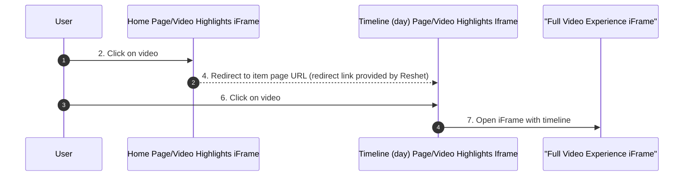

# Reshet13 <> Terrific Timeline: Integration Guide

This document explains how to integrate the terrific timeline iframe into your website.

## flow sequence diagram

    

## Integration Steps

### 1. Add the JavaScript File to your home and timeline (day) pages' headers

Add our JavaScript file by including this script tag in the `<head>` section of your HTML:

```html
<script async src="https://storage.googleapis.com/terrific-deploy.appspot.com/temp/integration-script.js"></script>
```

### 2. integrate the following Iframe code to your HOME PAGE

Add a the following html code to your HOME PAGE where you want the iframe to appear:
```html
<!-- Terrific Timeline Day Page Integration start -->
        <div id="terrific-timeline-div" style="width: 100%; height: 500px; border: none;">
            <iframe id="terrific-timeline-iframe"
            src="https://terrific-staging-polls.web.app/timeline/carrousel?id=5VKPd0aAyy98dI5j6o4Z&number-of-items=4&is-redirect=true"
            style="width: 100%; height: 100%; border: none;"
            title="Timeline Display"></iframe>
        </div>
        <!-- Terrific Timeline Day Page Integration end -->
```

### 3. integrate the following Iframe code to your daily TIMELINE page

Add a the following html code to your DAILY TIMELINE PAGE where you want the iframe to appear:

```html
<!-- Terrific Timeline Day Page Integration start -->
        <div id="terrific-timeline-div" style="width: 100%; height: 500px; border: none;">
            <iframe id="terrific-timeline-iframe"
            src="https://terrific-staging-polls.web.app/timeline/carrousel?id=5VKPd0aAyy98dI5j6o4Z&number-of-items=4&is-redirect=false"
            style="width: 100%; height: 100%; border: none;"
            title="Timeline Display"></iframe>
        </div>
        <!-- Terrific Timeline Day Page Integration end -->
```

### 3. Optional: Add Custom Styling

You can style the container as needed:

```css
.terrific-timeline-iframe-container {
    border: 1px solid #ccc;
    padding: 10px;
    margin: 20px 0;
}
```

## Important Notes

- **Temporary URLs**: The current URLs for both the JavaScript file and iframe source are temporary for testing purposes.
- **URL Updates**: You will need to update these URLs with the final production URLs when provided.
- **No Additional Configuration**: Once the correct URLs are in place, the integration should work without further 
- **WIP: we are still working on fine tunning the experience. This guidance provided to you to see how integration should work.
configuration.

## Additional Notes
- used timeline in the example is taken from the [store provided to your content editors from our staging environment](https://staging.terrific.live/reshet13/manage/assets-library?timelineId=5VKPd0aAyy98dI5j6o4Z)
- redirect link is taken from the timeline settings on our platform, which agreed to be populated by your content editors. We will always take the last one as the one to use in the redirect link.

## Troubleshooting

If you encounter any issues with the integration:
1. Ensure both the script and iframe URLs are correctly entered
2. Check that there are no JavaScript errors in your browser console
3. Verify that your website allows iframe embedding (no X-Frame-Options restrictions)

For further assistance, please contact us. 