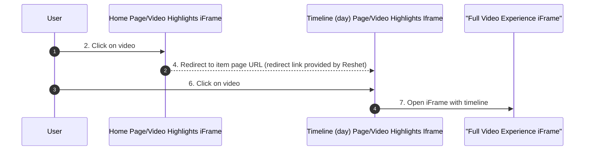

# Reshet13 <> Terrific Timeline: Integration Guide

This document explains how to integrate the terrific timeline iframe into your website.

## Flow Sequence Diagram

    

## Integration Steps

### 1. Add the JavaScript File to your home and timeline (day) pages' headers

Add our JavaScript file by including this script tag in the `<head>` section of your HTML:

```html
<script async src="https://terrific.live/timeline.js"></script>
```

### 2. integrate the following Iframe code to your HOME page

Add a the following html code to your HOME PAGE where you want the iframe to appear:
```html
<!-- Terrific Timeline Day Page Integration start -->
        <div id="terrific-timeline-div">
            <iframe id="terrific-timeline-iframe"
            src="https://polls.terrific.live/timeline/carrousel?id=<timeline-id>&number-of-items=4&is-redirect=true"
            style="width: 100%; height: 100%; border: none;"
            title="Timeline Display"></iframe>
        </div>
        <!-- Terrific Timeline Day Page Integration end -->
```

### 3. integrate the following Iframe code to your daily TIMELINE page

Add a the following html code to your DAILY TIMELINE PAGE where you want the iframe to appear:

```html
<!-- Terrific Timeline Day Page Integration start -->
        <div id="terrific-timeline-div">
            <iframe id="terrific-timeline-iframe"
            src="https://polls.terrific.live/timeline/carrousel?id=<timeline-id>&number-of-items=4&is-redirect=false"
            style="width: 100%; height: 100%; border: none;"
            title="Timeline Display"></iframe>
        </div>
        <!-- Terrific Timeline Day Page Integration end -->
```

## Next.js and Mobile App Integration

For applications built with Next.js, follow these steps to integrate the terrific timeline:

### 1. Adding the JavaScript File in Next.js

Add the script to your Next.js application by including it in your `_document.js` or `_app.js` file:

```jsx
// In pages/_document.js
import Document, { Html, Head, Main, NextScript } from 'next/document'

class MyDocument extends Document {
  render() {
    return (
      <Html>
        <Head>
          <script async src="https://terrific.live/timeline.js" />
        </Head>
        <body>
          <Main />
          <NextScript />
        </body>
      </Html>
    )
  }
}

export default MyDocument
```

### 2. Integrating the iFrame in Next.js HOME page component

```jsx
// In your home page component
export default function HomePage() {
  return (
    <div>
      {/* Other content */}
      <div id="terrific-timeline-div" style={{ width: '100%', height: '300px' }}>
        <iframe 
          id="terrific-timeline-iframe"
          src="https://polls.terrific.live/timeline/carrousel?id=<timeline-id>&number-of-items=4&is-redirect=true"
          style={{ width: '100%', height: '100%', border: 'none' }}
          title="Timeline Display"
        />
      </div>
      {/* Other content */}
    </div>
  )
}
```

### 3. Integrating the iFrame in Next.js TIMELINE page component

```jsx
// In your timeline page component
export default function TimelinePage() {
  return (
    <div>
      {/* Other content */}
      <div id="terrific-timeline-div" style={{ width: '100%', height: '300px' }}>
        <iframe 
          id="terrific-timeline-iframe"
          src="https://polls.terrific.live/timeline/carrousel?id=<timeline-id>&number-of-items=4&is-redirect=false"
          style={{ width: '100%', height: '100%', border: 'none' }}
          title="Timeline Display"
        />
      </div>
      {/* Other content */}
    </div>
  )
}
```

### 4. Mobile-Specific Considerations

When implementing for mobile applications:
- Ensure responsive layout by using relative dimensions (percentages)
- Consider adjusting the `number-of-items` parameter for smaller screens
- Test touch interactions within the iframe on mobile devices
- Use CSS media queries to adjust iframe height based on device width

## Important Notes

- **No Additional Configuration**: Once the correct URLs are in place, the integration should work completely 
- we support start-time qa parameter for both the carousel and the timeline. by adding start-time=<yyyymmddhh>
example: &start-time=202506241105
for the carousel - it will present the <number-of-items> coming after the closest asset to the mentioned <start-time>.
fot the timeline scroll experience - it will open the closest item to the mentioned <start-time>.
if no hour supported (i.e &start-time=20250624), it will present the latest item that day and will act as if it was yyyymmdd2359 (02506242359 in the example)

## Additional Notes
- timeline-id should be taken from your terrific admin panel under timelines
- redirect link of the home page carousel click is taken from the timeline settings on our platform, which should be populated by your content editors. We will always take the last one as the one to use in the redirect link.

## Troubleshooting

If you encounter any issues with the integration:
1. Ensure both the script and iframe URLs are correctly entered
2. Check that there are no JavaScript errors in your browser console
3. Verify that your website allows iframe embedding (no X-Frame-Options restrictions)

For further assistance, please contact us. 